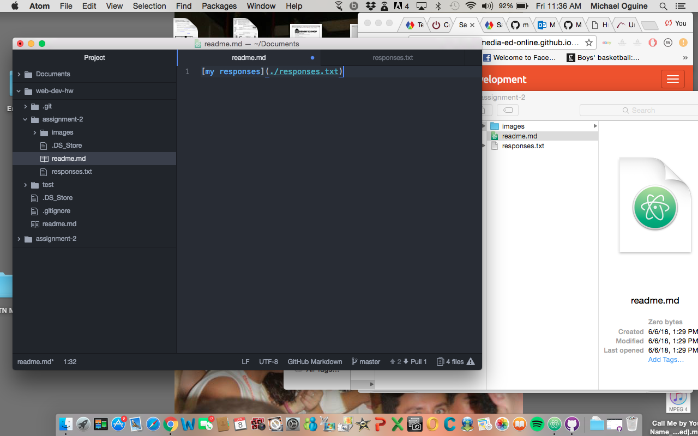

# Assignment 2
**Version contol allows a developer to make changes to a file and track their changges over time. Version control also allows for a developer to make changes that may or may not work. We use a VCS in this class because it makes collaboration and sharing easier.**

[my responses](./responses.txt)

