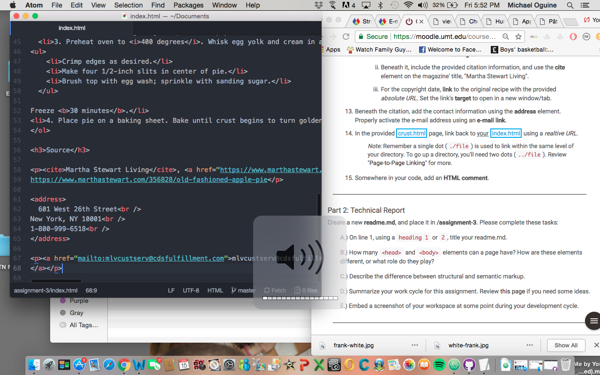

<h1>Assignment 3 Technical Report</h1>

 D. I started off with the four main elements. From there, I started adding some tags. After my tags, I began to add the files that were provided for us. I then followed the steps and made the page look the way that the client requested. It took a while, but I got the hang of it.

