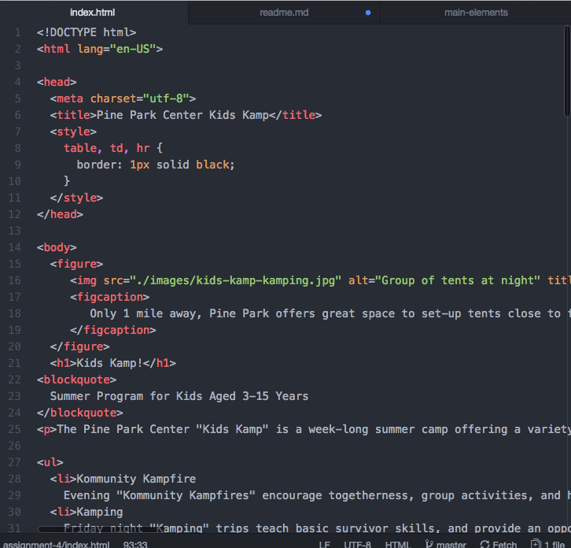

<h1>Assignment 4 Technical Report</h1>

Alt text is a word or phrase that can be inserted as an attribute in an HTML document to tell the viewers of the website the contents of an image. This text is found in a box where the image would normally be.

I've seen forms when I am filling out a survey. The purpose they serve is to limit the amount of options that are available for a viewer to choose from.

I started off with my main elements. Then I used the notes to include the information in the HTML. From there, I created a form and then a table. I added a fieldset and then a submit button when I was done.

