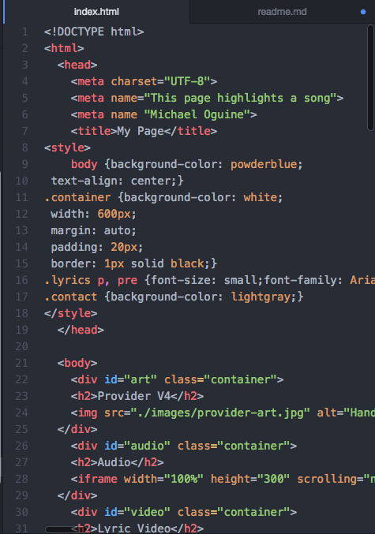

<h1>Assignment 5 Technical Report</h1>

A div is a block level HTML element. It's purpose is to divide other tags into groups that make sense. A span is an inline element that is used to to group a set of inline elements. You can use span to hook text that you want to style differently. ID is used to label sections of your html. Class specifies one or more classnames for an element. It's used to point to a class in a style sheet.

I might consider a third party over self hosted media because more people are comfortable with a popular site. The video format could also be more compatible with devices of readers.

I began by adding my 4 main document elements and my meta tags. I then broke my page into the div elements. I assigned names to each of my sections. I completed the rest of the instructions which included embedding different media.

