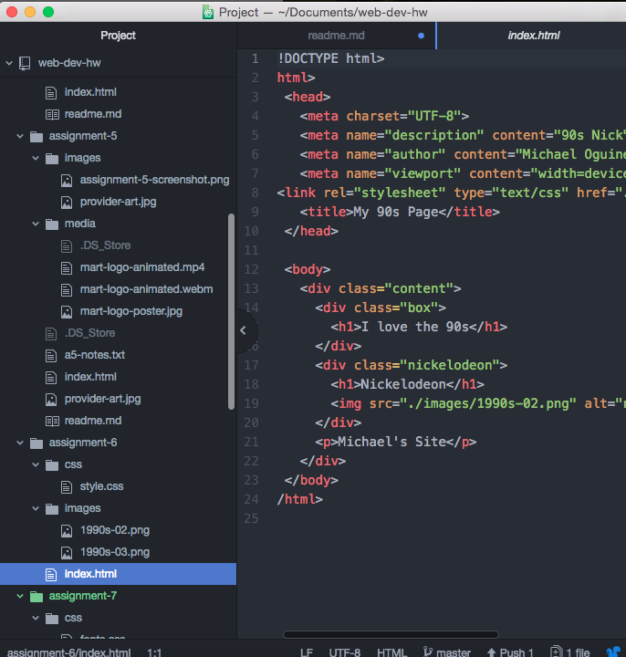

<h1>Assignment 6 Technical Report<h2>

I researched some popular colors from the 90s. I decided to go with the classic Nickelodeon logo and added another retro image that I thought looked cool. I styled it by choosing colors that truly fit the 90s theme.

My color palette was orange, yellow, indigo, and purple.

My work cycle started with me adding the head elements and then choosing a style. I used selector types and selector chains to further style. I changed the opacity of a few elements.

