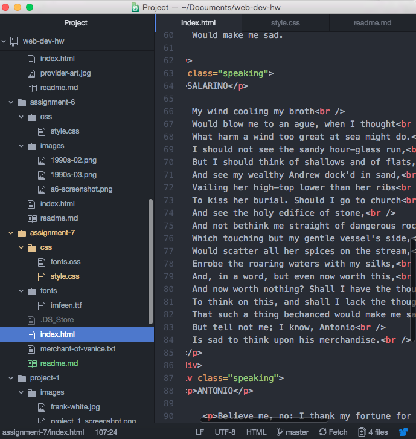

<h1>Assignment 7 Technical Report</h1>

I wanted my website to have a Shakespearean feel. I chose fonts and colors that reflected this time period.

A system font is a font that is already installed on the computer. A webfont is a specially designed font that is made using CSS for websites. A web safe font is a font that is preinstalled by operating systems.

I started by picking my excerpt. I found one that I liked and then I added it to my html. I spiced it up with some semantic and structural elements. I went over to my style sheet and made the font look nice. Then I added some pseudo elements and a read more button.

