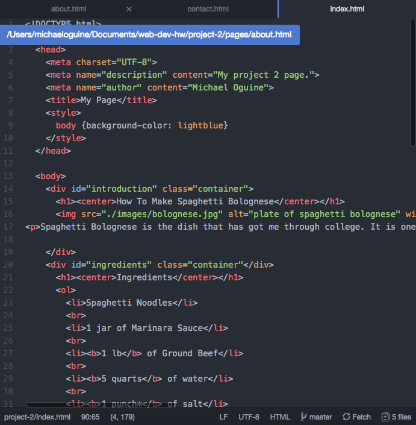

<h1>Project 2 Technical Report<h1>

I had a good experience learning HTML. I feel like I really learned a new language. It was cool to learn how to modify text and I used what I learned in this class to make my text on reddit look all fancy. I was wondering how people added strike through text and bold on Reddit and now I know.

I really want to learn how to make a very stylish page. I want to have full control over every element of a page. I also am curious to find out how people design their own styles.

This assignment asked me to put together everything I have learned in this course so far into one task. I started off with the basics. Then I moved into the dev elements. After the dev elements, I used the structural and semantic elements thatI learned to make my webpages look good.

